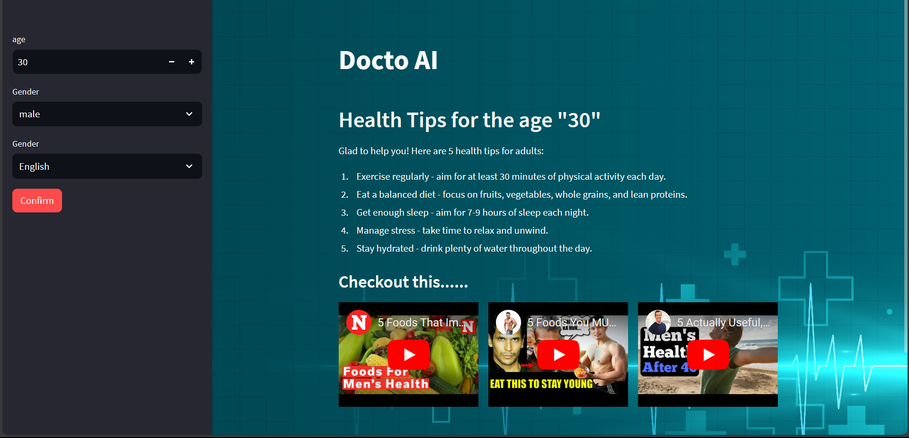

# LangChain-beginner-project
Creating a web app for suggesting some healthtips using LLMs like OpenAI



## To use the web app locally 
1. Open cmd on the desired location
1. clone the project using this command in cmd 
```python
https://github.com/ansilmbabl/LangChain-beginner-project.git
```
3. Install the dependencies by running the command  
```python
pip insall -r requirements.txt
``` 
4. create a file named `secretkey.py` inside the folder `Chains` and save your [OPENAI_API_KEY](https://help.openai.com/en/articles/4936850-where-do-i-find-my-secret-api-key) like this
```python
openai_api_key = "sk-****************************"
```
5. Run the following command in cmd to host the web app on your browser
```python
streamlit run app.py
```
